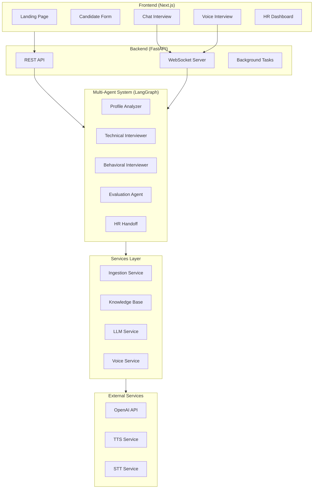
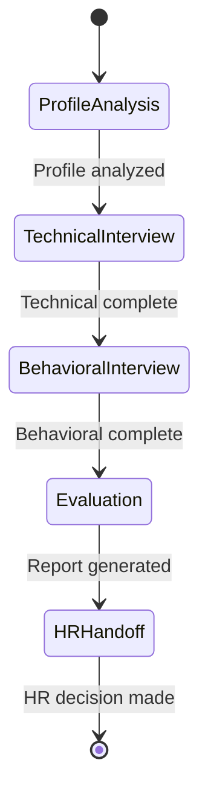

# Architecture Documentation

## System Overview

The AI Candidate Assessment Platform is a production-grade multi-agent system designed for intelligent candidate evaluation through chat and voice-based interviews.

## High-Level Architecture



## Data Flow

### 1. Candidate Registration Flow
```
User Input → Candidate Form → POST /api/candidates → Background Task
                                                         ↓
                                          LinkedIn Parser (Mock)
                                          GitHub Parser (Mock)
                                          Resume Parser (PDF → JSON)
                                                         ↓
                                          Knowledge Base Construction
```

### 2. Chat Interview Flow
```
User Message → WebSocket → Orchestrator → Current Agent
                                              ↓
                              Context Retrieval (Knowledge Base)
                                              ↓
                                    LLM Processing
                                              ↓
                              Response + State Transition Check
                                              ↓
                          WebSocket Response → UI Update
```

### 3. Voice Interview Flow
```
User Speech → MediaRecorder → Base64 Audio → WebSocket
                                                 ↓
                                          STT (Whisper/Browser)
                                                 ↓
                                         Text Transcription
                                                 ↓
                                      Agent Processing (Same as Chat)
                                                 ↓
                                          Text Response
                                                 ↓
                                          TTS (OpenAI/Browser)
                                                 ↓
                          Audio Base64 → WebSocket → Audio Playback
                                                         ↓
                                              Avatar State Update
```

## Agent State Machine



## Component Details

### Frontend Components

| Component | Path | Description |
|-----------|------|-------------|
| Landing Page | `/` | Hero section, features, CTA |
| Candidate Form | `/candidate` | Data input, file upload |
| Chat Interview | `/chat` | Real-time chat UI |
| Voice Interview | `/voice` | Voice controls, avatar |
| HR Dashboard | `/hr` | Stats, candidate table, decisions |

### Backend Modules

| Module | Path | Description |
|--------|------|-------------|
| Main | `app/main.py` | FastAPI app, middleware, routes |
| Config | `app/config.py` | Pydantic settings |
| Routers | `app/routers/` | API endpoint handlers |
| Agents | `app/agents/` | LangGraph agent implementations |
| Services | `app/services/` | Business logic layer |
| WebSockets | `app/websockets/` | Real-time handlers |
| Models | `app/models/` | Pydantic data models |

### Agent Responsibilities

| Agent | Responsibilities |
|-------|------------------|
| Profile Analyzer | Initial greeting, profile review, strength identification |
| Technical Interviewer | Technical questions, code discussion, system design |
| Behavioral Interviewer | STAR method, soft skills, culture fit |
| Evaluation Agent | Score aggregation, report generation |
| HR Handoff | Handoff preparation, decision processing |

## Security Considerations

1. **API Keys**: Stored in environment variables, never hardcoded
2. **CORS**: Configured for specific origins only
3. **Input Validation**: Pydantic models for all inputs
4. **File Upload**: Size limits, type validation

## Scalability

1. **Stateless Backend**: Can run multiple instances
2. **WebSocket**: Connection-based state
3. **Background Tasks**: Async processing for heavy operations
4. **Caching**: Redis support for session data

## Deployment

### Development
```bash
# Backend
uvicorn app.main:app --reload

# Frontend
npm run dev
```

### Production
```bash
docker-compose up --build
```

## Technology Stack

| Layer | Technology |
|-------|------------|
| Frontend | Next.js 14, React 18, Tailwind CSS |
| Backend | FastAPI, Python 3.11 |
| AI/ML | LangChain, OpenAI GPT-4 |
| Real-time | WebSockets |
| Deployment | Docker, Docker Compose |
